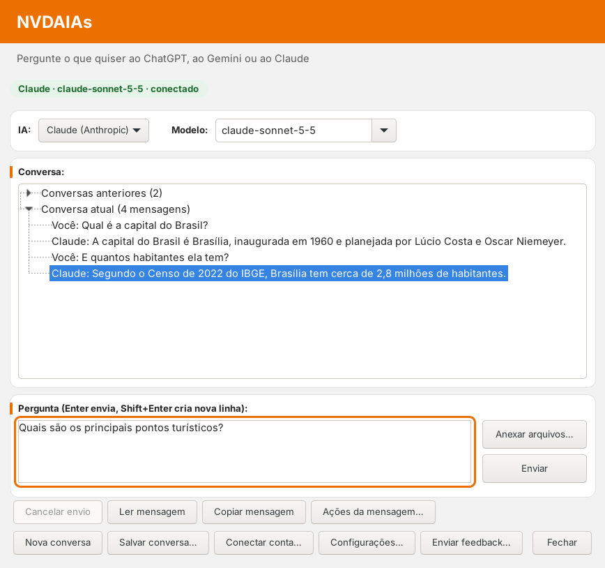
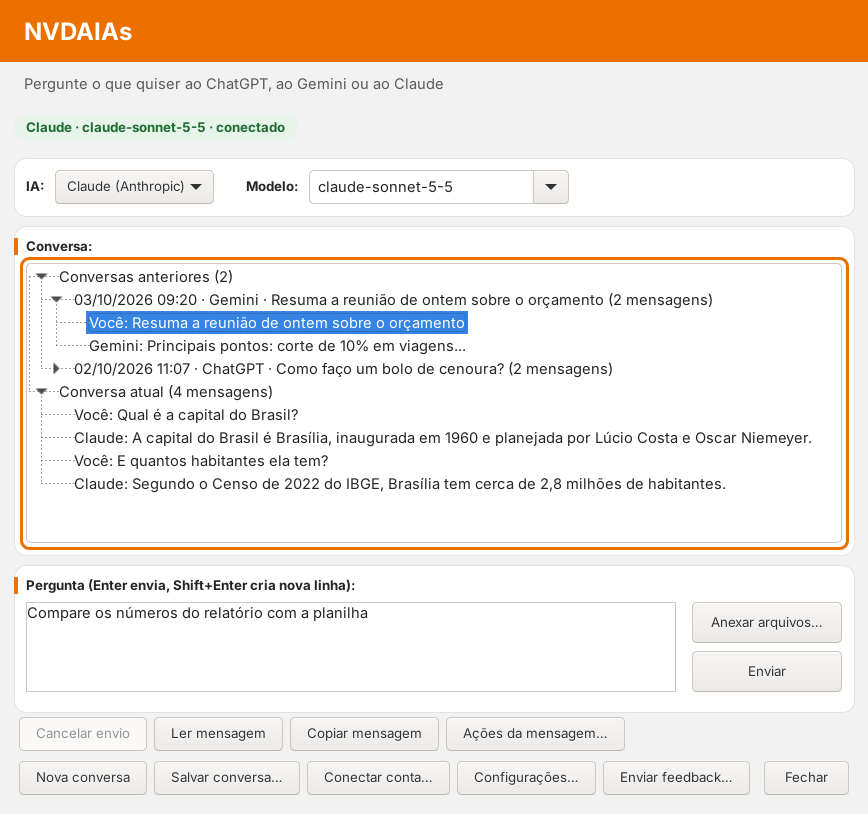
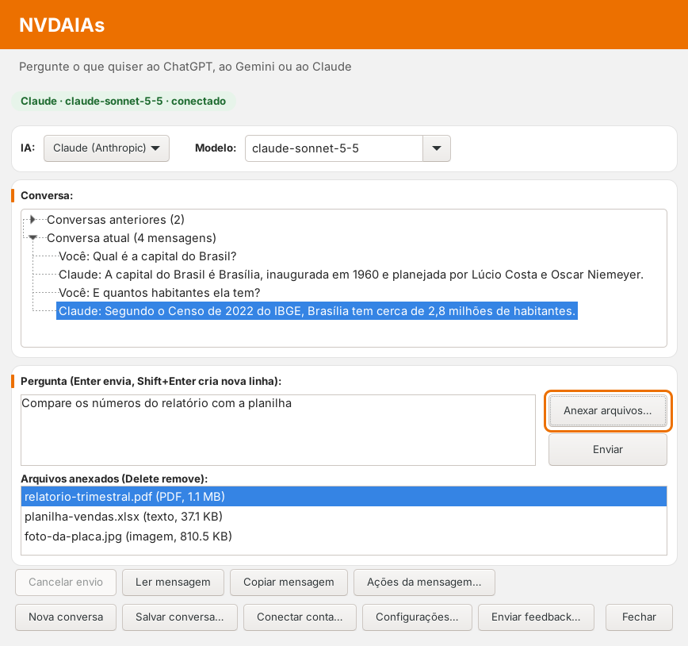
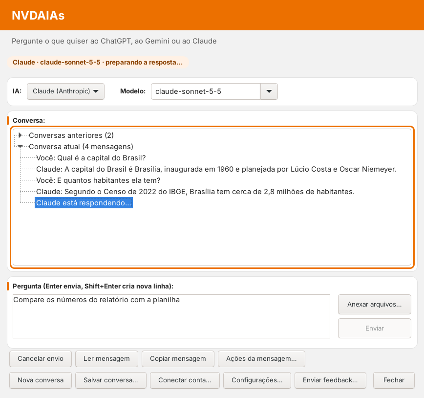
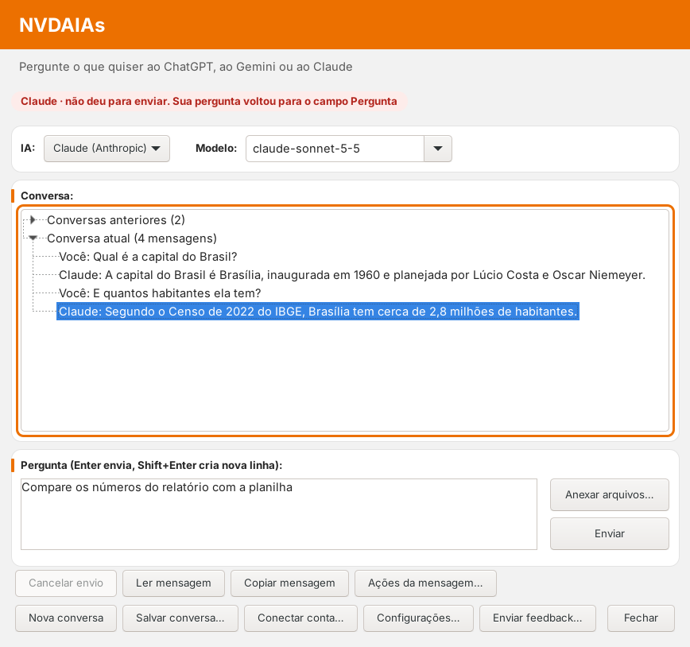
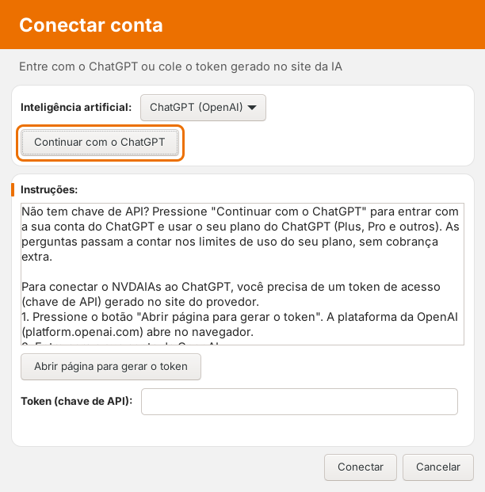

# Design do NVDAIAs – layout moderno

O visual das janelas do NVDAIAs segue a linguagem de um app bancário moderno: barra superior laranja, fundo cinza-claro, **cartões brancos com cantos arredondados** para cada grupo de controles, situação em **chip** colorido e um **anel de foco laranja arredondado**. As cores, fontes, espaçamentos, raios e o tom de voz seguem a identidade visual pública do banco que inspirou o tema, **sem logotipo, nome ou qualquer identificação da marca** na interface.

Tudo sai de **design tokens**, num único arquivo: `addon/globalPlugins/NVDAIAs/design/tokens.json`. O código (`theme.py`) só lê os tokens. Para mudar uma cor, uma fonte, um raio ou um espaçamento, basta alterar o JSON. Os testes (`tests/test_theme.py`) recalculam o contraste de cada par e falham se algum ficar abaixo do mínimo.

## Princípios

1. **Acessibilidade em primeiro lugar.** Texto com contraste mínimo de 4,5:1 (3:1 só para texto grande em negrito) e indicadores visuais com 3:1, como pede a WCAG 2.2 nível AA.
2. **O leitor de telas não muda.** Botões, listas e campos são os controles nativos do Windows. Cabeçalho, cartões, chip e anel de foco são só pintura: não recebem foco, não mudam a ordem de tabulação nem os nomes que o NVDA lê.
3. **A cor nunca é a única informação.** O chip de situação diz em texto o que a cor mostra.
4. **Respeito ao sistema.** Com o alto contraste do Windows ativo, o tema se desliga e valem as cores do sistema. O tema também pode ser desligado nas configurações.
5. **Foco bem visível.** O controle com foco ganha um anel laranja de 3px com cantos arredondados, além do indicador normal do Windows. Todo controle com anel fica sobre um cartão branco, onde o laranja tem 3:1.

## Cores

| Token | Valor | Uso |
|---|---|---|
| `brand.orange` | `#EC7000` | Barra do cabeçalho, barra de destaque dos cartões, anel de foco |
| `brand.orangeDark` | `#A84F00` | Laranja escuro (texto em laranja sobre branco) |
| `brand.blue` | `#003A70` | Azul-escuro de apoio (links) |
| `surface.page` | `#F2F2F2` | Fundo das janelas |
| `surface.card` | `#FFFFFF` | Fundo dos cartões, da lista e dos campos |
| `surface.header` | `#EC7000` | Barra do cabeçalho |
| `text.primary` | `#252525` | Texto principal e títulos dos cartões |
| `text.secondary` | `#595959` | Subtítulo e rótulos fora dos cartões |
| `text.onHeader` | `#FFFFFF` | Título no cabeçalho (texto grande em negrito) |
| `text.accent` | `#A84F00` | Títulos de grupos |
| `text.link` | `#003A70` | Links |
| `border.card` | `#E3E3E3` | Borda fina dos cartões (decorativa) |
| `border.focus` | `#EC7000` | Anel de foco |
| `status.ok` | `#1E6B30` | Chip: conectado (texto) |
| `status.okBg` | `#E7F4EA` | Chip: conectado (fundo) |
| `status.busy` | `#8A4100` | Chip: respondendo (texto) |
| `status.busyBg` | `#FFF1E5` | Chip: respondendo (fundo) |
| `status.error` | `#B3261E` | Chip: erro (texto) |
| `status.errorBg` | `#FDECEA` | Chip: erro (fundo) |
| `status.idle` | `#4B4B4B` | Chip: não conectado (texto) |
| `status.idleBg` | `#E6E6E6` | Chip: não conectado (fundo) |

## Contraste

| Par | Contraste | Mínimo |
|---|---|---|
| `text.primary` sobre `surface.page` | 13.69:1 | 4,5:1 |
| `text.primary` sobre `surface.card` | 15.33:1 | 4,5:1 |
| `text.secondary` sobre `surface.page` | 6.26:1 | 4,5:1 |
| `text.secondary` sobre `surface.card` | 7.00:1 | 4,5:1 |
| `text.accent` sobre `surface.card` | 5.55:1 | 4,5:1 |
| `text.link` sobre `surface.card` | 11.42:1 | 4,5:1 |
| `status.ok` sobre `status.okBg` | 5.79:1 | 4,5:1 |
| `status.busy` sobre `status.busyBg` | 6.69:1 | 4,5:1 |
| `status.error` sobre `status.errorBg` | 5.72:1 | 4,5:1 |
| `status.idle` sobre `status.idleBg` | 6.99:1 | 4,5:1 |
| `text.onHeader` sobre `surface.header` | 3.05:1 | 3:1 (texto grande em negrito) |
| `border.focus` sobre `surface.card` | 3.05:1 | 3:1 |
| `brand.orange` sobre `surface.card` | 3.05:1 | 3:1 |

O laranja da marca com texto branco só chega a 3,05:1. Por isso, sobre a barra laranja vai **apenas o título**, em 18pt negrito (texto grande pela WCAG). O subtítulo fica logo abaixo, sobre o fundo cinza, em `text.secondary`.

## Tipografia

A família é escolhida na ordem dos tokens, usando a primeira que estiver instalada no Windows: `Itaú Text › Segoe UI Variable Text › Segoe UI`. Para títulos: `Itaú Display › Segoe UI Variable Display › Segoe UI Semibold › Segoe UI`. Se a fonte da marca não estiver instalada (o caso comum, já que ela não é distribuída com o complemento), vale a Segoe UI Variable do Windows 11 ou a Segoe UI. Com a opção **Texto maior**, todos os tamanhos são multiplicados por 1,25.

| Token | Tamanho (pt) |
|---|---|
| `size.title` | 18 (negrito) |
| `size.subtitle` | 11 |
| `size.status` | 10 (negrito) |
| `size.body` | 11 |
| `size.label` | 10 (negrito) |

## Espaçamento, raios e bordas

* Espaços: `xs` 4px · `sm` 8px · `md` 12px (respiro interno dos cartões) · `lg` 16px · `xl` 24px (margem do cabeçalho)
* Raios: `card` 12px · `focus` 8px · `chip` 12px
* Bordas: `card` 1px · `accent` 4px (barra laranja do título do cartão) · `focus` 3px · `gap` 4px (distância entre o controle e o anel)

## Componentes

* **Cabeçalho** (`HeaderPanel`): barra laranja com o título em branco, 18pt negrito, e o subtítulo logo abaixo, no fundo da página.
* **Chip de situação** (`StatusLine`): texto em negrito com a IA, o modelo e o estado, sobre um fundo arredondado com a cor clara do estado (`status.*Bg`) e o texto na cor escura correspondente (`status.*`).
* **Cartão** (`Card`): retângulo branco com cantos de 12px e borda fina, atrás de um grupo de controles. Quando o cartão tem título, uma barra laranja de 4px marca o início do título. Na janela de conversa há três: IA e Modelo; Conversa; Pergunta com Anexar arquivos, Enviar e os arquivos anexados. Na tela Conectar conta há dois: a IA com Continuar com o ChatGPT; as instruções com o token.
* **Anel de foco** (`FocusFrames`): anel laranja de 3px, com cantos de 8px, em volta do controle com foco que estiver num cartão.
* **Botões**: nativos do Windows, sem cor própria, para o NVDA apresentá-los como sempre.

## Voz e tom

Os textos em português seguem o jeito de escrever do tema: **próximo, simples e direto**.

* Fale com a pessoa usando "você" e, quando couber, "a gente" ou a primeira pessoa do plural.
* Frases curtas, uma ideia por frase. Diga o que aconteceu e o que fazer em seguida.
* Verbo de ação nos botões ("Enviar", "Anexar arquivos", "Continuar com o ChatGPT").
* Erro sem culpa e sem jargão: em vez de "falhou", "não deu para enviar".
* Espera com acolhimento: "Só um instante".

| Antes | Depois |
|---|---|
| Converse com o ChatGPT, o Gemini e o Claude | Pergunte o que quiser ao ChatGPT, ao Gemini ou ao Claude |
| Cole o token gerado no site da IA | Entre com o ChatGPT ou cole o token gerado no site da IA |
| não conectado; ao enviar uma pergunta, a tela de conexão abre | ainda não conectado. Ao enviar a pergunta, mostramos como conectar |
| a última pergunta falhou e voltou para o campo Pergunta | não deu para enviar. Sua pergunta voltou para o campo Pergunta |
| respondendo… | preparando a resposta… |
| Digite uma pergunta primeiro | Escreva sua pergunta primeiro |
| Aguarde a resposta atual | Só um instante, a resposta anterior ainda está chegando |
| Cole o token no campo Token primeiro. | Cole o token no campo Token para continuar. |

## Layout da janela de conversa

1. Cabeçalho: barra laranja com o título e o subtítulo abaixo
2. Chip de situação
3. Cartão: IA e Modelo, lado a lado
4. Cartão: Conversa (árvore com Conversas anteriores e Conversa atual), que ocupa o espaço que sobrar quando a janela cresce
5. Cartão: Pergunta, com Anexar arquivos e Enviar ao lado, e os arquivos anexados (só quando há arquivos esperando)
6. Botões: Cancelar envio, Ler mensagem, Copiar mensagem, Ações da mensagem
7. Botões: Nova conversa, Salvar conversa, Conectar conta, Configurações, Enviar feedback, Gerenciar uso do ChatGPT (só com o plano em uso) e Fechar

## Prévias

As imagens abaixo foram geradas em Linux por `tests/screenshots.py`. Por isso, os botões e as caixas de combinação aparecem com o visual do Linux. No Windows eles têm a aparência normal do Windows, e as cores, os cartões, o cabeçalho, as fontes e o anel de foco são os mesmos.

* `design/chat-foco-pergunta.png`: janela de conversa com o foco na pergunta
* `design/chat-foco-lista.png`: foco na lista da conversa
* `design/chat-historico.png`: conversas anteriores expandidas
* `design/chat-anexos.png`: arquivos anexados esperando a próxima pergunta
* `design/chat-aguardando.png`: aguardando a resposta
* `design/chat-erro.png`: depois de um erro
* `design/conectar-conta.png`: tela Conectar conta, com Continuar com o ChatGPT
* `design/chat-sem-tema.png`: com o tema desligado

